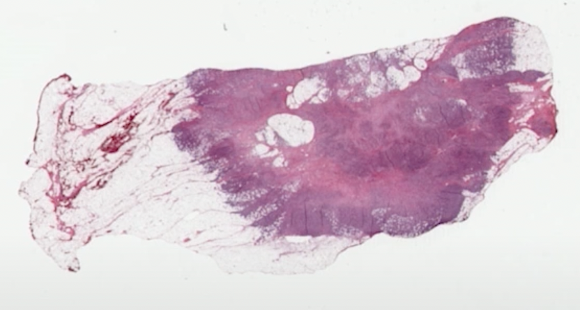

# Owkin-PIK3CA-mutation-detection

Owkin data challenge: https://challengedata.ens.fr/challenges/98

Ranked #1/183 submissions at the date 2023-12-15.

The code was executed on Google Collab. Data is accessible on the challenge website.

----

The challenge proposed by Owkin is a weakly-supervised binary classification problem. Weak supervision is crucial in digital pathology due to the extremely large dimensions of whole-slide images (WSIs), which cannot be processed as is (100,000 pixels x 100,000 pixels in this case). Each WSI is called a slide and is given a single binary annotation. For each slide, 1000 smaller images (called tiles) of size 224x224 pixels were extracted. 

In this challenge, we aimed to predict whether a patient has a mutation of the gene PIK3CA, directly from a slide.

Below is an example image:

