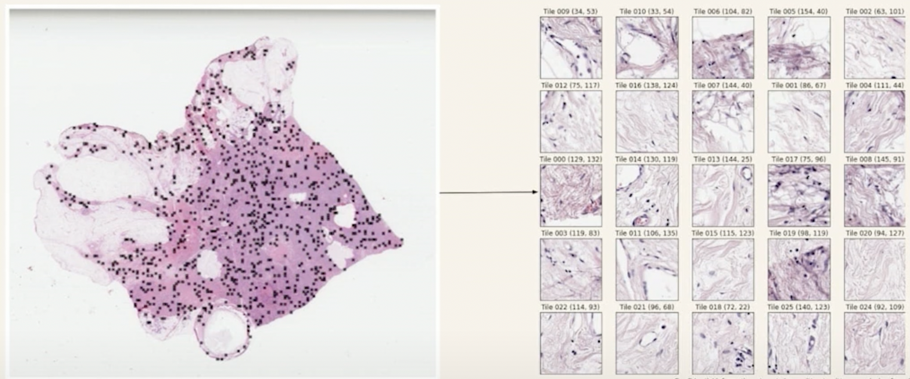

# 🧬 Owkin-PIK3CA-mutation-detection 🧬

:computer: Data challenge proposed by Owkin (weakly-supervised binary classification problem on histopathology images). Full description is available [here](https://challengedata.ens.fr/challenges/98).

🥇 My submission was ranked #1/183 and won the challenge. You can find the slide deck of my presentation at the Collège de France on the 31st of January, 2024 [here](https://docs.google.com/presentation/d/1qGJOGAy_EydOmG7Mcw0OHzWEHvGQTn-9/edit?usp=sharing&ouid=116993149234486675499&rtpof=true&sd=true).

The code was executed on Google Collab. Data is accessible on the challenge website upon registration.

## The data

The data consisted in binary annotated histopathology images. In this specific context, each image is refered to as a "slide".

Due to their extremely large dimensions (100,000 pixels x 100,000 pixels in this case), digital pathology images cannot be processed as is. For each slide, 1000 smaller images (called tiles) of size 224 x 224 pixels were extracted at random in order to reduce data weight.

Each slide is given a binary annotation. Tiles are not annoted. Hence the weak supervision.

Below is an example of a full slide:

And here is an example of what we mean by "tiles":

There were N = 344 annotated slides in the training set, each with 1000 tiles.

Owkin anticipated that students would not have enough computing power to build an efficient architecture to train upon 344 x 1000 tiles and extracted features from each tile based on the following method:

For each tile, MoCo v2 features were extracted using a Wide ResNet-50-2 pre-trained on TCGA-COAD (histopathology images dataset). Each feature vector has a length of 2048.

Therefore, each slide was represented by a 1000 x 2048 featur matrix.

## The challenge

The goal of the challenge was to predict whether a patient was a carrier of a genetic mutation of the gene PIK3CA, given a histology slide.

For each slide, the model output must be a float number between 0.0 and 1.0 representing the probability of PIK3CA mutation.

## My approach

Based on the idea that a genetic mutation is diffuse (as opposed to a cancerous mutation, which is localized), I decided to broadcast the label of the slide to each of its corresponding tile.
